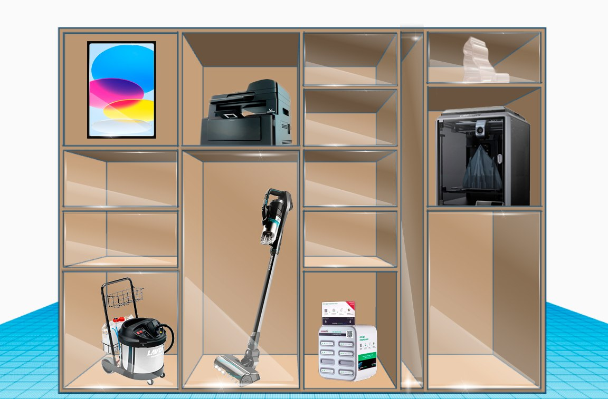
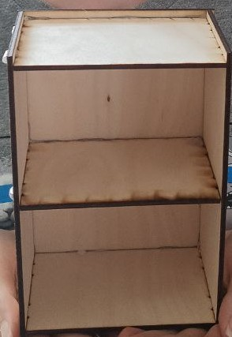
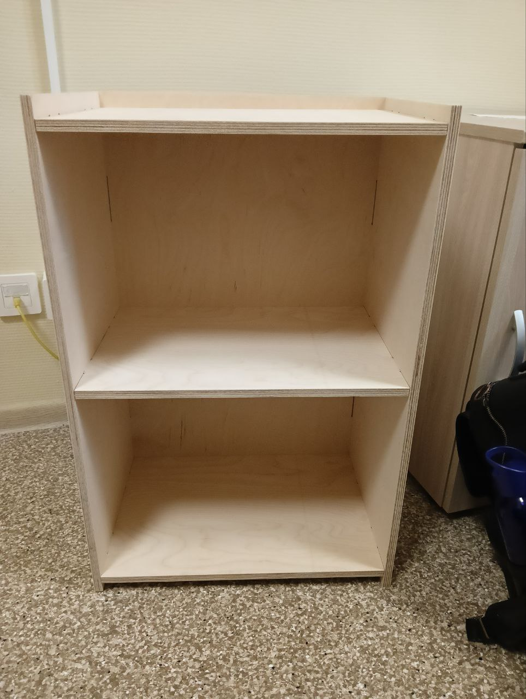
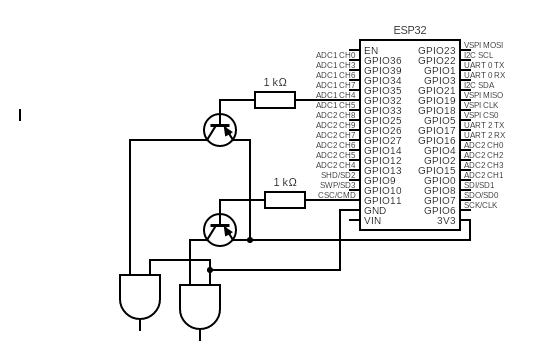
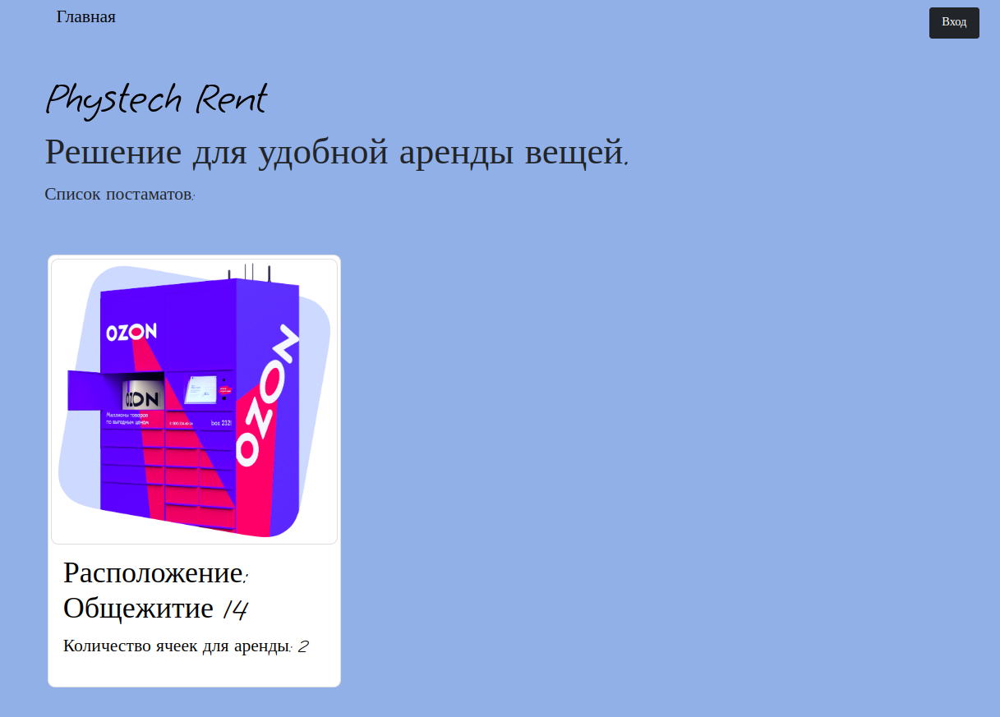
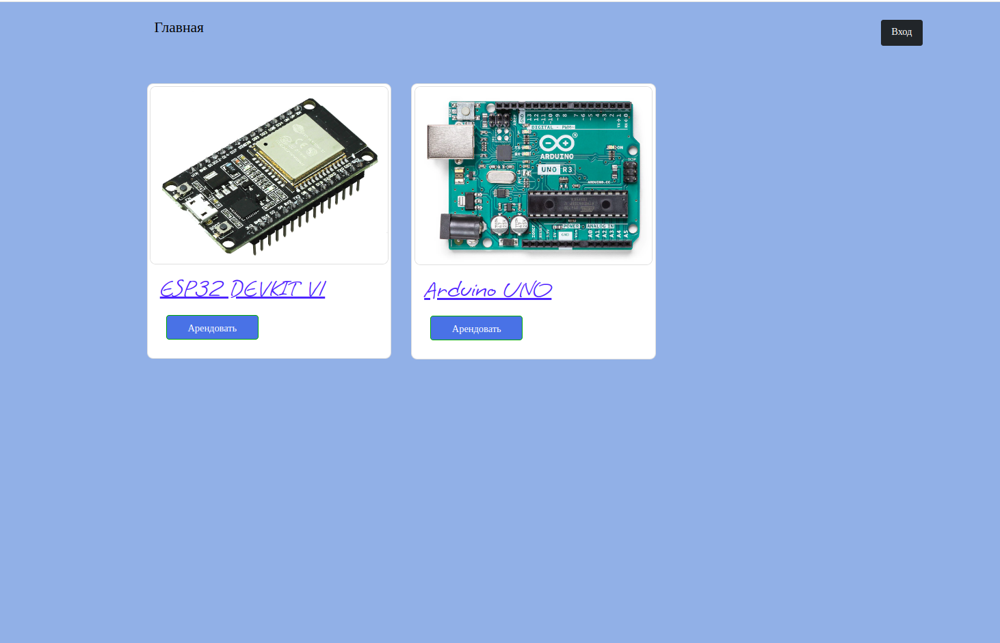
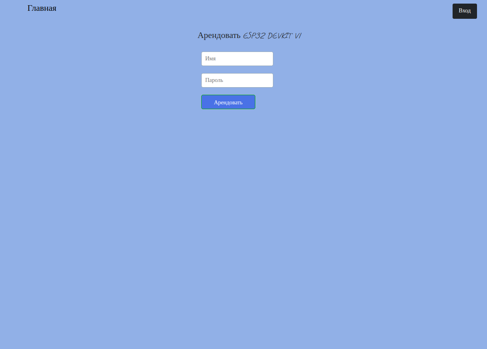
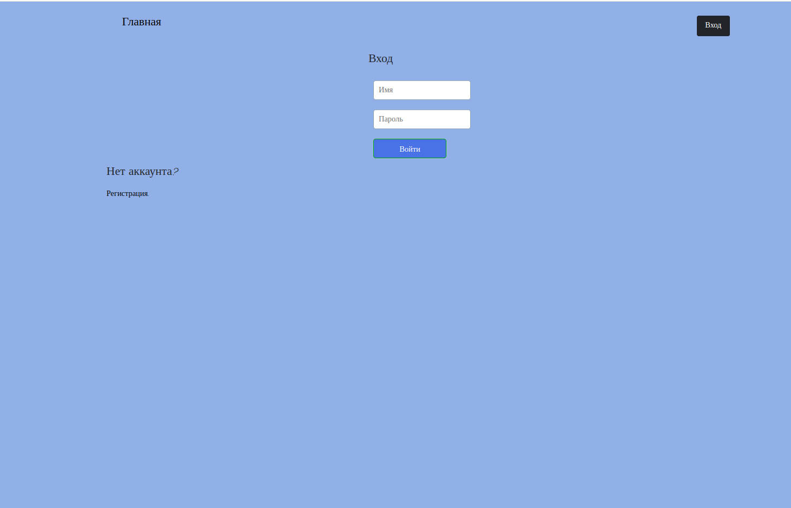
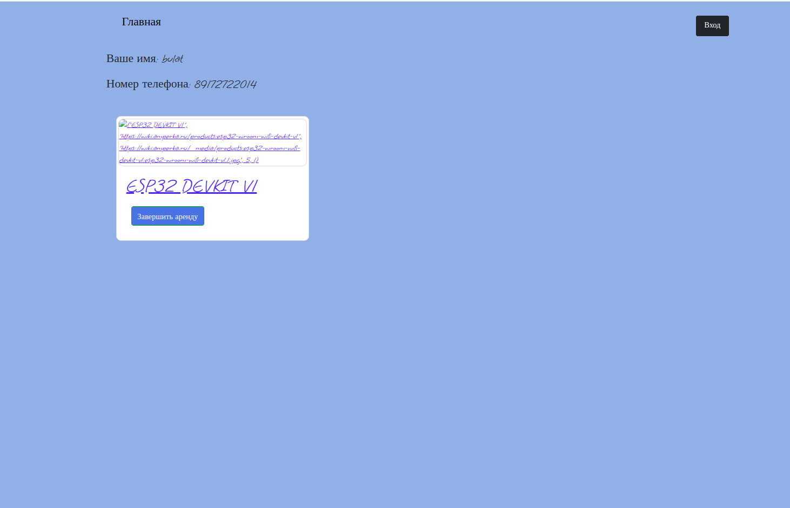

# Проект: Вендинговый шкаф для аренды приборов (Phystech Rent)

## Команда:
Мухина Анфиса Дмитриевна: Дизайн модели большого шкафа; Создание 3д модели прототипа шкафа; Сборка прототипа; Построение схемы и тестирование замка
Сигбатулин Булат: Разработка веб интерфейса; Создание 3д модели прототипа шкафа; Сборка прототипа; Настройка взаимодействия сервера с NSP32.
Мотриченко Арсений: Создание 3д модели прототипа шкафа; Сборка прототипа; Дизайн веб интерфейса; Закупка комплектующих
Нвер Авагимян: Создание 3д модели прототипа шкафа; Сборка прототипа; Закупка комплектующих

## Описание продукта:
Необходимые предметы для быта занимают слишком много места, невзвешенные покупки, которые пылятся на полках, вещи, которые стоят стоят слишком дорого. Все эти проблемы может решить наш проект — вендинговый шкаф с почасовой арендой необходимой техники от пылесоса до плей стейшн.

Наш проект состоит из: шкафа, в котором будут храниться вещи для аренды, и сайта, через который можно бронировать определённый слот и завершать бронь, после использования.

## Цель работы
Разработать прототип устройства и сервиса для удобной аренды различных вещей: бытовой техники, электронных комплектующих, инструментов и т.д. При некоммерческом использовании данное устройство может облегчить заимствование различных электронных устройств в Радиотехнической комнате (находится в 1 общежитии), Физтех Фабрике и на других площадках МФТИ. С помощью него можно будет избавиться от прослойки в виде ответственного за выдачу человека, иметь возможность "арендовать" (бесплатно) нужную вещь в любой время, а ответственному - просто и быстро отслеживать кто и когда взял в использование определенный предмет.

## Задачи

В ходе работы нужно будет решить несколько основных задач:
 - Посмотреть на существующие решения, и определить размеры и используемые материалы и комплектующие для нашего прототипа
 - Смоделировать прототип в специализированной программе (SolidWorks)
 - Собрать прототип
 - Релизовать программную модель прототипа
 - Релизовать сервис, через который будет осуществляться "аренда" в прототипе

## Анализ существующих аналогов

### Tulu

Это зарубежная компания, её нет на Российском рынке.

О постмате. В основном корпус выполнен из дерева, но имеются железные вставки. Такой выбор материала обеспечивает красивый вид, однако фанера, является более крепким материалом. Двери выполнены из стекла, это не самый надёжный вариант, но зато клиент может чётко видеть вещи, доступные к аренде, и их состояние. Замок на постматах Tulu не оснащён толкателем, он помогает клиенту понять, какой именно отсек активировался и облегчает открытие дверей, если в них нет ручек, но у шкафов Tulu дверцы прозрачные и в них добавлены ручки, что решает проблему.

Больгим приемуществом является доступность предметов для аренды, клиент не должен ждать достаку, и может сразу забрать продукт. В приложении есть временная гибкость, для вещей предусмотрена почасовая оплата. В отзывах люди жалуются на плохую работу приложения, например, польщователь переустанавливал его 3 раза прежде чем приложение заработало. Так же клиенты отмечают трудности с завершением аренды: приложение зависает и не даёт завершить аренду, в то время как деньги за арендованную вещь продолжают начисляться. Помимо всего прочего пользователи отмечают плохую работу поддержки, которая долго отвечает на сообщения, из-за этого у людей не получается вовремя решить проблему и они теряют деньги и время. 

### Арентер

Корпус постмата выполнен из железа, что даёт повышенную устойчивость к огню и воде. Часть дверей выполнены из стекла, часть полностью из железа не позволяя клиентам видеть, что находится внутри. На дверцах отсутствуют ручки, однако в ячейках стоят удобные замки с толкателем, что позволяет удобно открывать и закрывать дверь.

Арентер, как сервис по аренде, давно существует на Российском рынке, но аренду в формате постмата они ввели меньше месяца назад. По большей части эта компания ориентируется на то, что клиент сначала заказывает товар со склада, ждёт доставку и уже потом забирает предмет, это уменьшает доступность, поскольку клиент получает товар не сразу. Однако их приложение и предметы для аренды можно рассмотреть. У данного сервиса сложности с автоматизацией: непонятные цены, пользователи отмечают, что информация о ценах в приложении отличается от реальной, нет точной информации о том, что доступно в аренду, а что нет, любые вопросы уточняются через оператора, который зачастую отсутствует. 

### Наш вариант

Исследовав аналоги, мы поняли, что большое внимание стоит уделить приложению для аренды, нужно сделать его максимально прозрачным и минимизировать проблемы, о которых говорилось в отзывах у других компаний. Также мы решили реализовывать приложение в виде веб-интерфейса, так как это минимизирует проблемы, которые могут возникать из-за плохой поддержки приложения на разных устройствах. Рассмотрев различные реализации дверей постматов мы выбрали вариант со стеклом, это повышает заинтересованность пользователей и показывает, что вещи, хранящиеся в шкафу в надлежащем качестве. Возможно это не самый надёжный вариант, но в общежитии, где планируется применять наш шкаф, много камер, что повышает безопасность. Для уверенности можно привести в пример работу сервиса Self, который продаёт еду. Их товар лежит на полках, никак не закрытый, безопасность гарантируют качественные камеры, установленные на полках с товаром. Каркас нашего прототипа было решено сделать из фанеры, это надёжный и доступный материал. Для наилучшего скрепления составных частей шкафа мы сделали шиповое соединение у деталей. Двери мы решили делать без ручек в рамках экономии, удобное открытие гарантирует замок, который толкает дверь, чтобы она открылась широко. В качестве примера, на который мы впоследующем будем опираться, был нарисован примерный дизайн готового устройства:

## Ход работы

### Разработка корпуса

Модель разрабатывалась в приложении SolidWorks, в виде отдельных деталей, которые потом были объединены в виде сборки в том же приложении (детали и готовую сборку можно найти в папке box). Так как корпус будет вырезан из дерева было решено использовать для этого фрезерный станок, но перед этим, чтобы не тратить много дерева при неудаче, вырезать мини-модель с помощью лазерной резки:

После того, как мы убедились что все корректно собралось на фрезерном станке, из фанеры толщиной 12мм, был вырезан корпус протипа:

В завершении к корпусу были прикручены петли с стеклянными дверьми и электронные замки.

### Разработка электрической схемы

Теперь требуется определить электронную составляющую прототипа. Этим стали:

 - ESP32 - микроконтроллер, принимающий сигналы от веб сервера и управляющий замками.
 - XG07E Electronic Miniature Plastic Titanium Lock - замок используемый для открывания двери, с рабочим напряжением на входе.
 - Транзисторы TIP122 и резисторы на 1КОм для проектирования надежной электрической схемы открывания замка.

На картинке снизу представлена схема устройства, в качестве изображения замка используется схема элемента "логическое и":

Питание ESP32 в прототипе реализуется при помощи подключенного к порту micro-usb портативного зарядного устройства.

### Разработка сервера (веб-интерфейса) и клиента (код ESP32)

Сайт работает на основе библиотеки Flask (Python) с использованием баз данных под управлением MySQL. Данные хранятся в двух базах данных:
 - БД с пользователями (db/postamates.db)
 - БД с постаматами (user.db)

БД с пользователями хранит в себе одну таблицу - с информацией о пользователях:
 - Имя
 - Хэш пароля
 - Номер телефона

БД с постаматами хранит в себе 2 таблицы, таблицу с информацией о постаматах:
 - Id постамата
 - Ip адрес постамата (ESP32)
 - Расположение постамата

И таблицу с информацией о ячейках в каждом постамате:
 - Id постамата
 - Id ячейки (привязана к пину GPIO на ESP32, через который ячейка открывается)
 - Статус ячейки (есть ли там что-то или нет)
 - Id пользователя, который в последний раз оттуда что-то брал
 - Дата и время, когда оттуда что-то брали в последний раз
 - Информация о предмете, который там лежит

Код ESP32, хоть и называется клиентом, в свою очередь также является небольшим веб-сервером. Он представляет собой набор ссылок строящихся по шаблону - <esp_ip_addr>/<GPIO_PIN>/on. Здесь:
 - esp_ip_addr это ip адресс присваеваемый ESP
 - GPIO_PIN - номер пина GPIO, который управляет открытием и закрытием определенной ячейки.

При бронировании и возвращении предмета в ячейку, сайт (сервер) обращается по соответствующей ссылке ESP32 (клиента), а тот в свою очередь считывает это обращение и открывает ячейку. Открытие ячейки занимает определенное время из-за электрических характеристик замка. При входном напряжении 3 Вольта замку требуется чуть меньше 1 секунды на открытие, так как напряжение с выхода ESP32 подается сразу на два замка, это время было увеличено до 1,5 секунд, чтобы обеспечить стабильную работу устройства. Для бронирования необходимо перейти на сайт, выбрать постамат в нужной локации и устройство, которое вы хотите взять:

Для того, чтобы сайт определил кто вы и сохранил эту информацию нужно войти в свой аккаунт:

После того, как предмет арендован, на сайте будет невозможно его арендовать. Чтобы закончить аренду, нужно войти в свой аккаунт, нажав на кнопку вход в правом верхнем углу и кнопку завершить аренду:

## Проблемы возникшие в ходе работы

Успешный продукт (и его отдельные компоненты), как это часто бывает, был получен не сразу. Во время работы нас преследовало множество проблем и недочетов. Первой проблемой, с которой мы столкнулись, был недочет в вырезанных из фанеры на фрезере деталях. Она заключалась в том, что мы хоть и заложили в модели запас в 0.5 мм в расстоянии пазов по длине, забыли сделать то же самое по ширине. Из-за данного недочета, для того чтобы модель собралась мы сняли небольшой слой дерева на каждом из проблемных участков при помощи наждачной бумаги.

Вторая проблема возникла при работе с замком и ESP32. Изначальная идея заключалась в том, чтобы подключать один из входов замка напрямую к управляющему пину, в надежде на то, что при уровне сигнала соответствующем логической единице замок будет открываться. Однако ничего не происходило, хотя если подключать замок к выходам GND и 3.3 Вольт, замок сразу же открывался. Последующее тестирование показало, что при подключении замка к выходу GPIO, на нем сразу происходит падение напряжение, что не наблюдается на выходе 3.3 Вольт. Поэтому было решено подавать напряжение на замок с выхода 3.3 Вольт, через транзистор, а транзистором уже управлять при помощи пина GPIO. Также, чтобы ток, подавающийся на базу транзистора соответствовал требованиям документации, между выходом GPIO и базой транзистора был добавлен резистор с сопротивлением в 1 Ком.

И последняя проблема возникла при подключении к пину 3.3 Вольта 2 и более замков (с транзисторами). В таких случаях напряжение стало падать, а замку требоваться больше времени для открытия. Поэтому решением стало увеличить время задержки сигнала на высоком уровне с 1 секунды до 1.5 секунд.

## Результаты

Был разработан полностью рабочий прототип устройства для аренды различного типа предметов. В дополнение был создан веб-интерфейс для удобной работы с данным устройством со стороны клиента.

Полученный прототип успешно показал себя на тестах (видео) и даже может быть использован при желании.

<video controls src="img/video_2024-06-10_18-04-13.mp4" title="Видео работы устройства"></video>