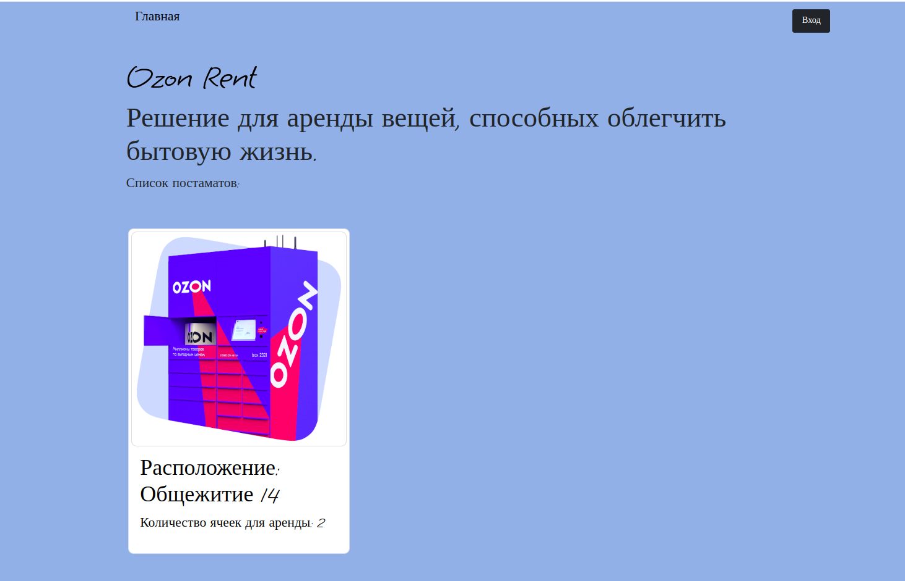

# Проект: Вендинговый шкаф для аренды приборов (Phystech Rent)

## Команда:
Мухина Анфиса Дмитриевна: Дизайн модели большого шкафа; Создание 3д модели прототипа шкафа; Сборка прототипа; Построение схемы и тестирование замка
Сигбатулин Булат: Разработка веб интерфейса; Создание 3д модели прототипа шкафа; Сборка прототипа; Настройка взаимодействия сервера с NSP32.
Мотриченко Арсений: Создание 3д модели прототипа шкафа; Сборка прототипа; Дизайн веб интерфейса; Закупка комплектующих
Нвер Авагимян: Создание 3д модели прототипа шкафа; Сборка прототипа; Закупка комплектующих

## Описание продукта:
Необходимые предметы для быта занимают слишком много места, невзвешенные покупки, которые пылятся на полках, вещи, которые стоят стоят слишком дорого. Все эти проблемы может решить наш проект — вендинговый шкаф с почасовой арендой необходимой техники от пылесоса до плей стейшн.

Наш проект состоит из: шкафа, в котором будут храниться вещи для аренды, и сайта, через который можно бронировать определённый слот и завершать бронь, после использования.

## Анализ существующих аналогов:
На данный момент на рынке существует 3 компании с аналогичной разработкой: Arenter, Tulu, next2u.

## Описание процесса проектирования:

1) Была подготовлена 3d модель прототипа шкафа в программе SolidWorks. 

2) Изготовлення модель была вырезана и собрана в миниатюре. Вырезание модели проходило при помощи лазерной резки на лазере GCC LaserPro из фанеры толщиной 3мм.

3) Проанализировав полученные результаты мы исправили выявленные недочёты 3d модели. После этого была проведена подготовка и вырезка готовой модели на фрезерном станке FLEXICAM из фанеры толщиной 12мм.

4) Получив детали, мы провели их шлифовку моделью Mirka DEROS 560. После подготовительных работ была проведена сборка шкафа: все детали были соединены между собой и зафиксированы саморезами размера 5мм x 20мм.

5) Были сделаны все необходимые закупки для завершения сборки шкафа:

- два оргстекла 2мм прозрачных 42×29,7 см, Акрил;
- два электрических замка XG07E Electronic Miniature Plastic Titanium Lock DC 12V.
- 4 петли для дверей 

6) Был создан веб интерфейс для взаимодействия с ESP-WROOM-32. Страницы авторизации, покупки и возврата товара с использованием Flask (Python) и баз данных MySQL.

7) Был написан код для замка в Arduino IDE. Он был успешно интегрирован в прошитый ESP-WROOM-32.

8) После успешной загрузки кода шкаф был полностью собран, и были проведены все необходимые тесты для того, чтобы удостовериться в его готовности.

9) Была создана 3d модель большого шкафа и был выполнен дизайн его практического наполнения, для работы над проектом в будущем.

## Описание процесса тестирования:

Тестирование модели шкафа:
После создания первой версии составных деталей была проведена борка 3д модели в solidworks, она помогла выявить недочеты деталей: некоторые расчёты были проведены неверно и детали накладывались друг на друга. Мы исправили эту проблему и при повторной сборке деташи соединились как надо. После этого был вырезан и собран маленький, тестовый вариант на лазерном станке. Сборка показала, что построенная модель работоспособна. Перед тем, как вырезать модель на станке мы скруглили все углы. При сборке обнаружилось, что не у всех отверстий был сделан достаточный допуск, и детали соединялись сложно, однако шлифовка помогла решить эту проблему.
Программное тестирование:
Был создан локальный сервер для тестирования работы передачи информации с веб интерфейса на ESP32. Тестирование электронных замков показало, что начальные схемы сборки не функциональные, поэтому была реализована схема состоящая из транзистора и управляющего пина.

## Принцип работы сайта

Сайт работает на основе библиотеки Flask (Python) с использованием баз данных под управлением MySQL. Данные хранятся в двух базах данных:
 - БД с пользователями
 - БД с постаматами

БД с пользователями хранит в себе одну таблицу - с информацией о пользователях:
 - Имя
 - Хэш пароля
 - Номер телефона

БД с постаматами хранит в себе 2 таблицы, таблицу с информацией о постаматах:
 - Id постамата
 - Ip адрес постамата
 - Расположение постамата

И таблицу с информацией о ячейках в каждом постамате:
 - Id постамата
 - Id ячейки (привязана к пину GPIO на ESP32, через который ячейка открывается)
 - Статус ячейки (есть ли там что-то или нет)
 - Id пользователя, который в последний раз оттуда что-то брал
 - Дата и время, когда оттуда что-то брали в последний раз
 - Информация о предмете, который там лежит

При бронировании и возвращении предмета в ячейку, сайт (сервер) отправляет сигнал ESP32 (клиенту), после чего тот открывает ячейку. Открытие ячейки занимает определенное время из-за электрических характеристик замка.

## Фото сайта

<video controls src="img/video_2024-06-10_18-04-13.mp4" title="Видео работы устройства"></video>